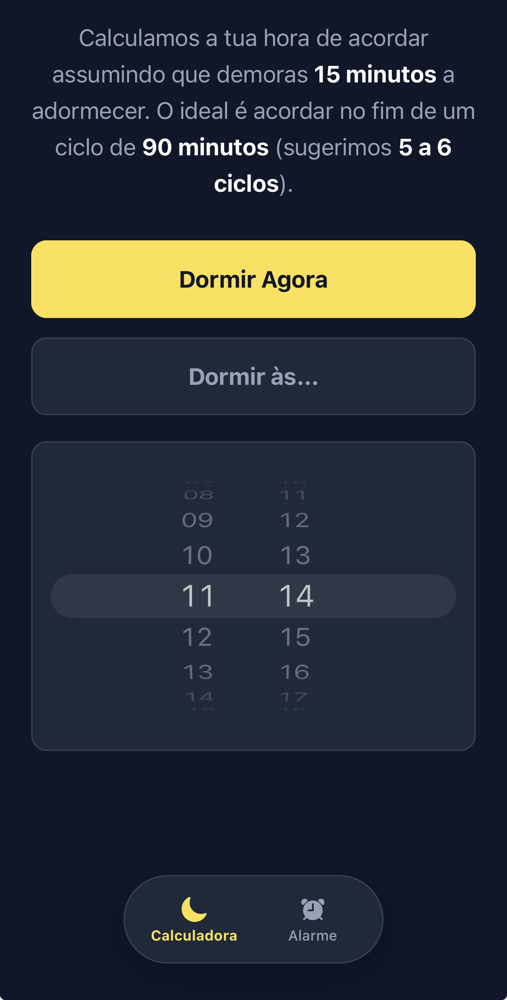
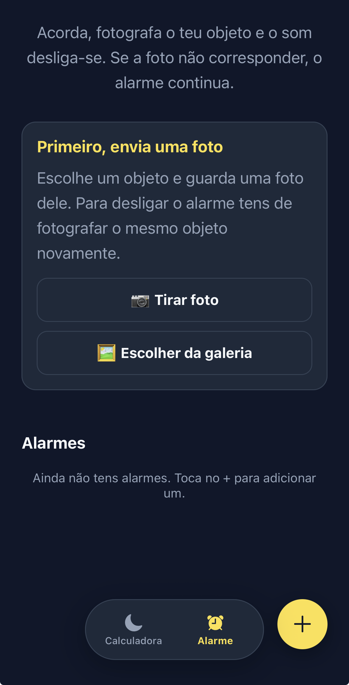

# UpShot

Wake-up alarm that makes you **actually get out of bed** - the only way to silence it is to photograph the object you chose beforehand.

## Features

### Sleep calculator
Calculates the best time to wake up based on 90-minute sleep cycles (with the 15 minutes it usually takes to fall asleep). Works two ways:

- **Sleep now** - suggested wake-up times starting from the current moment.
- **Sleep at...** - pick a time with the picker and get the suggested wake-up times from that point on.

Each suggested time has a **+ button** to create an alarm directly with that exact hour.

  

### Verified alarm
- Pick an object around you (ideally, outside the bedroom) and save **up to 3 reference photos** from different angles.
- When the alarm goes off, it keeps playing until you take a **new photo of that same object**.
- The match is verified **entirely on-device** by an image-similarity algorithm (perceptual hash + color comparison). Wrong object, angle or lighting? It gives you another try.
- While the alarm is ringing, a **Confirm now** button takes you straight to the camera so you can silence it as quickly as possible (the photo is still required).

  

## How it works

- **Expo SDK 57** (React Native, expo-router)
- Alarm sound handled with **expo-audio** (keeps playing in the background as long as the app isn't fully closed - iOS stops all audio if the app is force-quit, an Apple platform limitation)
- **expo-notifications** scheduled for each alarm as a safety net
- Reference photos are compared using pure JavaScript image hashing - no external server, everything stays local
- Reference photo storage + match logic in `src/utils` and `src/engine`

## License

Released under the [MIT License](LICENSE).

## A note on development

The idea is entirely mine, but the code was built through **vibecoding** - I don't master most of the technologies involved (nor even a large part of them). This project is a personal experiment in what's possible when you can guide an AI through an entire product, from idea to a working build.

## Distribution

Built for iOS. A GitHub Actions workflow (`.github/workflows/ipa.yml`) produces an unsigned IPA that can be installed via AltStore with a free Apple ID.
